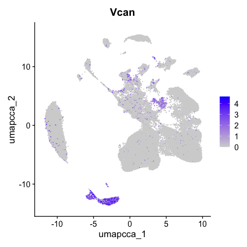

```{r setup, include=FALSE}
knitr::opts_chunk$set(echo = TRUE)
require(Seurat)
require(dplyr)
require(patchwork)
require(stringr)
require(ggplot2)
require(tidyverse)
require(Signac)
library(DT)
```

### Raw Data Summary
* snRNA sequencing data from 4 rat brain samples (C1, C2, T1, T2)
* scATAC sequencing data from 4 rat brain samples (C1, C2, T1, T2)

### Preprocessing
Following [this](https://support.10xgenomics.com/single-cell-gene-expression/software/pipelines/latest/using/tutorial_mr) and [this](https://support.10xgenomics.com/single-cell-multiome-atac-gex/software/pipelines/latest/advanced/references?src=social&lss=linkedin&cnm=soc-li-ra_g-program-li-ra_g-program&cid=7011P000000y072) tutorials from 10X, we built rat references for scRNA and scATAC based on *mRatBN7.2* assembly available on [NCBI](https://www.ncbi.nlm.nih.gov/datasets/genome/GCF_015227675.2/). 

Using the custom references, we ran the *Cell Ranger* and *Cell Ranger ATAC* pipelines to generate single cell feature counts and single cell accessibility counts, respectively, for all samples. The QC reports automatically generated from the pipelines were listed below:

- Cell Ranger Gene Expression
  - C1: [QC Report](https://jackaloppy.github.io/bibb_multiomics/qc_reports/c1_scrna.html)
  - C2: [QC Report](https://jackaloppy.github.io/bibb_multiomics/qc_reports/c2_scrna.html)
  - T1: [QC Report](https://jackaloppy.github.io/bibb_multiomics/qc_reports/t1_scrna.html)
  - T2: [QC Report](https://jackaloppy.github.io/bibb_multiomics/qc_reports/t2_scrna.html)
- Cell Ranger ATAC
  - C1: [QC Report](https://jackaloppy.github.io/bibb_multiomics/qc_reports/c1_scatac.html)
  - C2: [QC Report](https://jackaloppy.github.io/bibb_multiomics/qc_reports/c2_scatac.html)
  - T1: [QC Report](https://jackaloppy.github.io/bibb_multiomics/qc_reports/t1_scatac.html)
  - T2: [QC Report](https://jackaloppy.github.io/bibb_multiomics/qc_reports/t2_scatac.html)


### scRNA-seq analysis
Analysis was done in Seurat.
Load and merge the count outputs of the 4 samples. Then generate quality metrics for QC plots.
```{r eval=FALSE}
## Loading Cell Ranger pipeline outputs
c1_scrna <- Read10X("./data/c1_scrna_filtered_feature_bc_matrix/")
c1_scrna <- CreateSeuratObject(c1_scrna, project="C1", min.cells=3, min.feature=200)

c2_scrna <- Read10X("./data/c2_scrna_filtered_feature_bc_matrix/")
c2_scrna <- CreateSeuratObject(c2_scrna, project="C2",min.cells=3, min.feature=200)

t1_scrna <- Read10X("./data/t1_scrna_filtered_feature_bc_matrix/")
t1_scrna <- CreateSeuratObject(t1_scrna, project="T1",min.cells=3, min.feature=200)

t2_scrna <- Read10X("./data/t2_scrna_filtered_feature_bc_matrix/")
t2_scrna <- CreateSeuratObject(t2_scrna, project="T2",min.cells=3, min.feature=200)

## Merge the four samples
merged_obj <- merge(x = c1_scrna, y=c(c2_scrna, t1_scrna, t2_scrna), add.cell.ids = c("C1","C2","T1","T2"))

## Creating QC metrics and meta data
merged_obj$log10GenesPerUMI <- log10(merged_obj$nFeature_RNA) / log10(merged_obj$nCount_RNA)
merged_obj$mitoRatio <- PercentageFeatureSet(merged_obj, pattern = "^Mt-")
merged_obj$mitoRatio <- merged_obj@meta.data$mitoRatio / 100
merged_obj$riboRatio <- PercentageFeatureSet(merged_obj, pattern="^Rp[sl]")
merged_obj$riboRatio <- merged_obj@meta.data$riboRatio / 100
merged_obj$hbRatio <- PercentageFeatureSet(merged_obj, pattern="Hb[^(p)]")
merged_obj$hbRatio <- merged_obj@meta.data$hbRatio / 100

metadata <- merged_obj@meta.data
metadata$cells <- rownames(metadata)
metadata$sample <- metadata$orig.ident
metadata <- metadata %>%
  dplyr::rename(seq_folder = orig.ident,
                nUMI = nCount_RNA,
                nGene = nFeature_RNA)
```

```{r echo=FALSE}
metadata <- readRDS("../../data/scrna_metadata.rds")
options(scipen = 999)
```

Visualize the number of cells per sample. We see that T2 has around 5000 cells more than that of C1.
```{r}
metadata %>% 
  ggplot(aes(x=sample, fill=sample)) + 
  geom_bar() +
  theme_classic() +
  theme(axis.text.x = element_text(angle = 45, vjust = 1, hjust=1)) +
  theme(plot.title = element_text(hjust=0.5, face="bold")) +
  ggtitle("Number of cells")
```

Density plot showing the number of UMIs (transcripts) per cell for all four samples. A cut off line at 500 is displayed to indicate the common low end of scRNA-seq. This result suggests good sequence depths. 
```{r}
metadata %>% 
  ggplot(aes(color=sample, x=nUMI, fill= sample)) + 
  geom_density(alpha = 0.2) + 
  scale_x_log10(limits = c(100,NA)) + 
  theme_classic() +
  ylab("Cell density") +
  geom_vline(xintercept = 500)+
  ggtitle("UMI counts (transcripts) per cell")
```

Visualize the distribution of gene detected per cell. A cut off line at 300 is displayed to indicate a common threshold for good quality cell. This plot suggests that the samples might have two major types of cells (i.e. quiescent cell population and active cell population).
```{r}
metadata %>% 
  ggplot(aes(color=sample, x=nGene, fill= sample)) + 
  geom_density(alpha = 0.2) + 
  theme_classic() +
  scale_x_log10(limits = c(200,NA)) + 
  ylab("Cell density") +
  geom_vline(xintercept = 300)+
  ggtitle("Number of gene per cell")
```

Density plot showing the complexity (novelty score) of the samples. High complexity often suggests sample contains high complexity cell types (in contrast to low complexity cell types such as RBC). Generally, we expect the novelty score to be above 0.80.
```{r}
metadata %>%
  ggplot(aes(x=log10GenesPerUMI, color = sample, fill=sample)) +
  geom_density(alpha = 0.2) +
  theme_classic() +
  geom_vline(xintercept = 0.8) +
  xlim(0.7, NA) +
  ggtitle("Gene detected per UMI (novelty score)")
```

UMIs vs. genes detected per sample. Cells that are poor quality are likely to have low genes and UMIs per cell. Good cells will generally exhibit both higher number of genes per cell and higher numbers of UMIs (i.e. a linear relationship). The reduced slope at top right corner might indicates the presence of doublets. 
```{r}
metadata %>% 
  ggplot(aes(x=nUMI, y=nGene)) + 
  geom_point() + 
  scale_x_log10() + 
  scale_y_log10() + 
  theme_classic() +
  facet_wrap(~sample) +
  ggtitle("UMIs vs. genes")
```

```{r echo=FALSE}
merged_obj <- readRDS("../../data/merged_scrna.rds")
```

Violin plot showing the mitochondrial gene ratio, ribosomal gene ratio, and hemoglobin gene ratio. The three ratios should be minimal in snRNA-seq.
```{r warning=FALSE}
VlnPlot(merged_obj, features=c("mitoRatio","riboRatio","hbRatio"), group.by = "orig.ident")
```

Data integraion from all four samples, so that cells from the same cell type/subpopulation will cluster together.
```{r eval=FALSE}
# run standard analysis workflow
merged_obj <- NormalizeData(merged_obj)
merged_obj <- FindVariableFeatures(merged_obj)
merged_obj <- ScaleData(merged_obj)
merged_obj <- RunPCA(merged_obj)

# perform integration
merged_obj <- IntegrateLayers(merged_obj, method=CCAIntegration, 
                              orig.reduction="pca", new.reduction="integrated.cca",
                              verbose=FALSE)
```

After data integration, we can run dimensional reduction for the integrated data set. And we can plot elbow plot to determine the relevant dimensions of the data. In this case, we choose *dims = 1:14* because the standard deviation has minimal decrease after that point, so there are minimal benefits to continue increasing dims.
```{r}
ElbowPlot(merged_obj)
```

Run UMAP dimensional reduction and unsupervised clustering based on the dimensions we determined.
```{r eval=FALSE}
merged_obj <- FindNeighbors(merged_obj, reduction="integrated.cca", dims = 1:14)
merged_obj <- FindClusters(merged_obj, resolution = 0.1, cluster.name="cca_clusters")
merged_obj <- RunUMAP(merged_obj, dims=1:14, reduction="integrated.cca", reduction.name="umap.cca")
```

```{r}
DimPlot(merged_obj, reduction="umap.cca", group.by = "cca_clusters", split.by = "orig.ident")
```


Cell type annotation was made based on common marker genes for mouse whole cortex & hippocampus samples found on [Allen Brain Map](https://celltypes.brain-map.org/rnaseq/mouse_ctx-hpf_10x?selectedVisualization=Heatmap&colorByFeature=Cell+Type&colorByFeatureValue=Gad1), as well as [literature](https://www.ncbi.nlm.nih.gov/pmc/articles/PMC9458645/) on rat snRNA-seq analysis. Specifically:

- Neurons (overall): Grin2a
  - Gabaergic: Gad1, Gad2
  - Glutamatergic: Slc17a7
- Astrocytes: Gja1, Aqp4
- Oligodendrocytes: Plp1, Mag
- Microglia: Arhgap15, Csf1r
- OPC: Vcan, Pdgfra

```{r eval = FALSE}
## Checking expression levels on marker genes
FeaturePlot(merged_obj, reduction="umap.cca", features = "Cd79a")

## Interactively assign selected cell clusters into cell types
HoverLocator(plot=DimPlot(merged_obj,reduction="umap.cca"))
select.cells <- CellSelector(plot=DimPlot(merged_obj,reduction="umap.cca"))
Idents(merged_obj, cells=select.cells) <- "OPC"
```

**Neurons** marker genes expression level:
<div>
  
  
  
  <div style="clear: both;"></div>
</div>

**Astrocytes** marker genes expression level:
<div>
  
  
  <div style="clear: both;"></div>
</div>

**Oligodendrocytes** marker genes expression level:
<div>
  
  
  <div style="clear: both;"></div>
</div>

**Microglia** marker genes expression level:
<div>
  
  
  <div style="clear: both;"></div>
</div>

**OPC** marker genes expression level:
<div>
  
  
  <div style="clear: both;"></div>
</div>


Displaying the final annotated UMAP
```{r eval=FALSE}
DimPlot(merged_obj, reduction="umap.cca", split.by = "orig.ident")
```
<div>
  
  <div style="clear: both;"></div>
</div>

Number of cells and proportions for each annotated clusters
<div>
  
  
  <div style="clear: both;"></div>
</div>

***

Rudramani used [Sctype](https://www.nature.com/articles/s41467-022-28803-w) automated cell-type identification package to annotate brain tissue cell type. The results are shown below:
<div>
  
  
  
  <div style="clear: both;"></div>
</div>

### DEGs for T1 vs. C1 and T2 vs. C2.

Here we identified DEGs between T1 vs. C1, and DEGs between T2 vs. C2, within every cell type cluster in the data set. For simplicity, the first annotated map was used because it contains less sub-types. DEGs were filtered by adjusted p-value =< 0.05. Tables were listed below including the gene name as the index, p-value, average log2 fold change, percentage of cells expressing the gene in T1/T2, percent of cells expressing the gene in C1/C2, adjusted p values. 
```{r eval=FALSE}
## Rejoin the layers before performing any differential expression analysis.
merged_obj <- JoinLayers(merged_obj)
Idents(merged_obj) <- "orig.ident"

## Subseting into T1&C1, T2&C2 groups to do pairwise comparison.
TC1 <- subset(merged_obj, idents=c("T1","C1"))
TC2 <- subset(merged_obj, idents=c("T2","C2"))

Idents(TC1) <- "celltype"
Idents(TC2) <- "celltype"

## Do this for all cell type. i.e. changing "Neuron" to other cell types.
tc1_neuron_marker <- TC1 %>% FindMarkers(ident.1 = "T1", subset.ident="Neuron",
                         group.by="orig.ident", assay="RNA", min.pct = 0.25) %>% 
                          dplyr::filter(p_val_adj <= 0.05)
tc2_neuron_marker <- TC2 %>% FindMarkers(ident.1 = "T2", subset.ident="Neuron",
                         group.by="orig.ident", assay="RNA", min.pct = 0.25) %>% 
                          rownames() %>% .[1:50]

```


```{r echo=FALSE}
tc1_neuron_marker <- read.csv("../../results/tc1_neuron_marker.csv", row.names = 1)
tc2_neuron_marker <- read.csv("../../results/tc2_neuron_marker.csv", row.names = 1)
tc1_oligo_marker <- read.csv("../../results/tc1_oligo_marker.csv", row.names = 1)
tc2_oligo_marker <- read.csv("../../results/tc2_oligo_marker.csv", row.names = 1)
tc1_opc_marker <- read.csv("../../results/tc1_opc_marker.csv", row.names = 1)
tc2_opc_marker <- read.csv("../../results/tc2_opc_marker.csv", row.names = 1)
tc1_micro_marker <- read.csv("../../results/tc1_micro_marker.csv", row.names = 1)
tc2_micro_marker <- read.csv("../../results/tc2_micro_marker.csv", row.names = 1)
tc1_astro_marker <- read.csv("../../results/tc1_astro_marker.csv", row.names = 1)
tc2_astro_marker <- read.csv("../../results/tc2_astro_marker.csv", row.names = 1)


DT::datatable(tc1_neuron_marker, colnames = c("p-value","Average Log2FC", "Pct. T1","Pct. C1","adjusted p-value"), caption = "DEGs for T1 vs. C1 within Neuron cluster", options=list(pageLength=5))
DT::datatable(tc2_neuron_marker, colnames = c("p-value","Average Log2FC", "Pct. T2","Pct. C2","adjusted p-value"), caption = "DEGs for T2 vs. C2 within Neuron cluster", options=list(pageLength=5))
DT::datatable(tc1_oligo_marker, colnames = c("p-value","Average Log2FC", "Pct. T1","Pct. C1","adjusted p-value"), caption = "DEGs for T1 vs. C1 within Oligodendrocyte cluster", options=list(pageLength=5))
DT::datatable(tc2_oligo_marker, colnames = c("p-value","Average Log2FC", "Pct. T2","Pct. C2","adjusted p-value"), caption = "DEGs for T2 vs. C2 within Oligodendrocyte cluster", options=list(pageLength=5))
DT::datatable(tc1_opc_marker, colnames = c("p-value","Average Log2FC", "Pct. T1","Pct. C1","adjusted p-value"), caption = "DEGs for T1 vs. C1 within OPC cluster", options=list(pageLength=5))
DT::datatable(tc2_opc_marker, colnames = c("p-value","Average Log2FC", "Pct. T2","Pct. C2","adjusted p-value"), caption = "DEGs for T2 vs. C2 within OPC cluster", options=list(pageLength=5))
DT::datatable(tc1_micro_marker, colnames = c("p-value","Average Log2FC", "Pct. T1","Pct. C1","adjusted p-value"), caption = "DEGs for T1 vs. C1 within Microglia cluster", options=list(pageLength=5))
DT::datatable(tc2_micro_marker, colnames = c("p-value","Average Log2FC", "Pct. T2","Pct. C2","adjusted p-value"), caption = "DEGs for T1 vs. C1 within Microglia cluster", options=list(pageLength=5))
DT::datatable(tc1_astro_marker, colnames = c("p-value","Average Log2FC", "Pct. T1","Pct. C1","adjusted p-value"), caption = "DEGs for T1 vs. C1 within Astrocyte cluster", options=list(pageLength=5))
DT::datatable(tc2_astro_marker, colnames = c("p-value","Average Log2FC", "Pct. T2","Pct. C2","adjusted p-value"), caption = "DEGs for T2 vs. C2 within Astrocyte cluster", options=list(pageLength=5))
```


### scATAC-seq analysis

I loaded the scATAC-seq outputs from 10X pipeline into R and used Signac for analysis.

```{r eval=FALSE}
### Loading required files for Signac. Run this sciprt for every sample.
counts <- Read10X_h5("./data/c1_scatac/filtered_peak_bc_matrix.h5")
metadata <- read.csv(
  file = "./data/c1_scatac/singlecell.csv",
  header = TRUE,
  row.names=1
)
assay <- CreateChromatinAssay(
  counts = counts,
  sep = c(":","-"),
  genome = "mRatBN7.2",
  fragments = "./data/c1_scatac/fragments.tsv.gz",
  min.cells = 1
)
c1 <- CreateSeuratObject(
  counts = assay,
  assay = "peaks",
  project = "C1",
  meta.data = metadata
)
```

Add gene annotations to chromatin data for rat genome. This will allow downstream functions to pull the gene annotation information. 
```{r eval=FALSE}
## Add gene annotations to the object
library(GenomeInfoDb)
gtf <- rtracklayer::import("./data/Rattus_norvegicus.mRatBN7.2.110.filtered.gtf")
gene.coords <- gtf[gtf$type == 'gene']
gene.coords <- keepStandardChromosomes(gene.coords, pruning.mode = 'coarse')

Annotation(c1) <- gene.coords
Annotation(c2) <- gene.coords
Annotation(t1) <- gene.coords
Annotation(t2) <- gene.coords
```

Computing QC metrics following the [tutorial](https://stuartlab.org/signac/articles/pbmc_vignette) from Signac. Pre-processing each sample.
```{r eval=FALSE}
# Computing QC metrics
c1 <- NucleosomeSignal(c1)
c1$nucleosome_group <- ifelse(c1$nucleosome_signal > 4, 'NS > 4', 'NS < 4')
FragmentHistogram(c1, region = '1-1-1000000')

c1 <- TSSEnrichment(c1, fast = FALSE)
c1$high.tss <- ifelse(c1$TSS.enrichment > 2, 'High', 'Low')
TSSPlot(c1, group.by = 'high.tss') + NoLegend()

c1$pct_reads_in_peaks <- c1$peak_region_fragments / c1$passed_filters * 100
c1$blacklist_ratio <- c1$blacklist_region_fragments / c1$peak_region_fragments

## Pre-processing each dataframe before merging
c1 <- FindTopFeatures(c1, min.cutoff = 10)
c1 <- RunTFIDF(c1)
c1 <- RunSVD(c1)
```

Merge the four samples into one dataframe.
```{r eval=FALSE}
## Merge
c1$dataset <- "C1"
c2$dataset <- "C2"
t1$dataset <- "T1"
t2$dataset <- "T2"
merged <- merge(x = c1, y = list(c2, t1, t2), add.cell.ids = c("C1","C2","T1","T2")) 

## Pre-processing merged object before integration
merged <- FindTopFeatures(merged, min.cutoff = 10)
merged <- RunTFIDF(merged)
merged <- RunSVD(merged)
merged <- RunUMAP(merged, dims=2:30, reduction="lsi")
split <- SplitObject(merged, split.by="dataset")

```


Violin plot to show various QC metrics across samples. Detailed explanations shown below.
```{r eval=FALSE}
VlnPlot(
  object = merged,
  features = c('nCount_peaks', 'TSS.enrichment', 'blacklist_ratio', 
               'nucleosome_signal', 'pct_reads_in_peaks'),
  pt.size = 0.1,
  ncol = 5,
  split.by = "dataset"
)
```
<div>
  
  <div style="clear: both;"></div>
</div>

- *nCount_peaks*: Total number of fragments in peaks. A measure of cellular sequencing depth / complexity. Cells with **very few reads (i.e. fewer than a few thousands)** may need to be excluded due to low sequencing depth. Cells with **extremely high levels (i.e. tens of thousands)** may represent doublets, nuclei clumps, or other artefacts.
- *TSS.enrichment*: Transcriptional start site (TSS) enrichment score. This score is based on the ratio of fragments centered at the TSS to fragments in TSS-flanking regions. It is a measure of how well an ATAC-seq experiment targets regions around the TSS. Lower scores typically indicate poor targeting and may be characteristic of lower quality ATAC-seq experiments **(i.e. TSS enrichment score < 3)**.
- *blacklist_ratio*: The ENCODE project has provided a list of [blacklist regions](https://github.com/Boyle-Lab/Blacklist), representing reads which are often associated with artefactural signal. A high proportion of reads in these areas (compared to reads mapping to peaks) often indicates technical artifacts in the cells.
- *nucleosome_signal*: This metric quantifies the ratio of mononucleosomal to nucleosome-free fragments in a single cell, based on the histogram of DNA fragment sizes. A strong nucleosome banding pattern corresponding to the length of DNA wrapped around a single nucleosome is expected.
- *pct_reads_in_peaks*: Fraction of fragments in peaks. This metric indicates the proportion of all fragments that fall within ATAC-seq peaks. **Low values (i.e. <15-20%)** can be indicative of low-quality cells or technical artifacts. 

Based on the suggested ranges from *nCount_peaks*, *TSS.enrichment*, and *pct_reads_in_peaks*, as well as warnings from QC reports by 10X pipelines (see Preprocessing section in the report), we have noticed certain aspects that suggest the data may not entirely meet the optimal quality standards typically expected for the scATAC-seq. 

Nonetheless, we proceeded the downstream analysis but the results should be interpreted carefully. First, we completed the integration steps.

```{r eval=FALSE}
## Find intergration anchors.
integration.anchors <- FindIntegrationAnchors(
  object.list = split,
  anchor.features = rownames(split),
  reduction = "rlsi",
  dims = 2:30
)

## Integration
integrated <- IntegrateEmbeddings(
  anchorset = integration.anchors,
  reductions = merged[["lsi"]],
  new.reduction.name = "integrated_lsi",
  dims.to.integrate = 1:30
)

## Dimensional reduction and unsupervised clustering
integrated <- RunUMAP(integrated, reduction = "integrated_lsi", dims = 2:30)
integrated <- FindNeighbors(object = integrated, reduction = 'integrated_lsi', dims = 2:30)
integrated <- FindClusters(object = integrated, verbose = FALSE, algorithm = 3)
DimPlot(integrated, split.by="dataset", group.by = "seurat_clusters")
```
<div>
  
  <div style="clear: both;"></div>
</div>


Then we create a gene activity matrix to visualize the activities of canonical marker genes to help interpret out ATAC-seq clusters. Note that the activities will be much noisier than scRNA-seq measurements. 
```{r eval=FALSE}
gene.activities <- GeneActivity(integrated)

# add the gene activity matrix to the Seurat object as a new assay and normalize it
integrated[['RNA']] <- CreateAssayObject(counts = gene.activities)
integrated <- NormalizeData(
  object = integrated,
  assay = 'RNA',
  normalization.method = 'LogNormalize',
  scale.factor = median(integrated$nCount_RNA)
)

DefaultAssay(scatac) <- 'RNA'
FeaturePlot(
  object = scatac,
  features = c('Gad2', 'Gja1', 'Plp1', 'Csf1r', 'Pdgfra'),
  pt.size = 0.1,
  max.cutoff = 'q95',
  ncol = 3
)
```
<div>
  
  <div style="clear: both;"></div>
</div>

The gene activities are indeed noisier, which might due to the quality of the scATAC-seq. But we tried to annotated based on the activity levels.
```{r eval=FALSE}
## Actively select or rename idents to cell types
select.cells <- CellSelector(plot=DimPlot(integrated))
Idents(integrated, cells=select.cells) <- "Neurons"

## Show annotated UMAP
DimPlot(integrated, split.by="dataset")
```
<div>
  
  <div style="clear: both;"></div>
</div>

